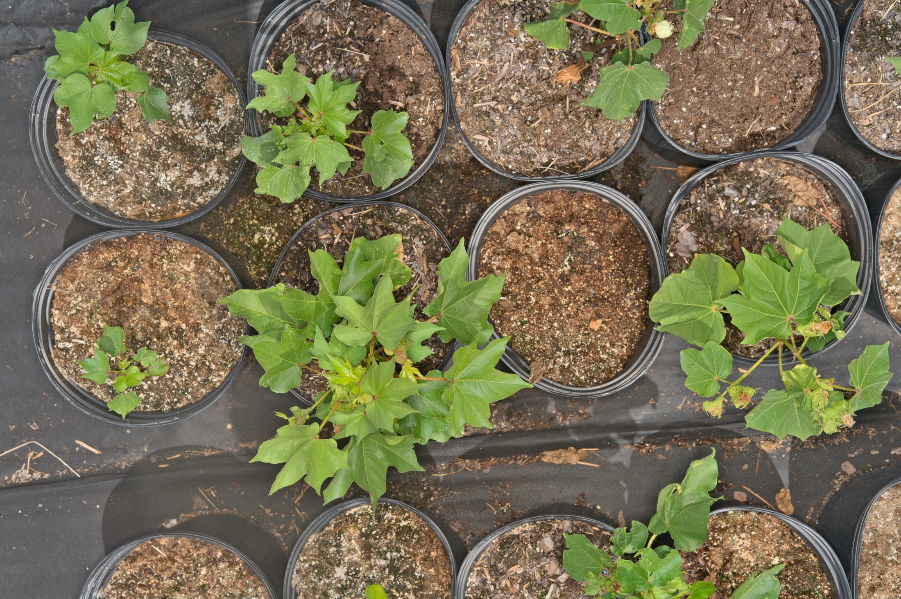
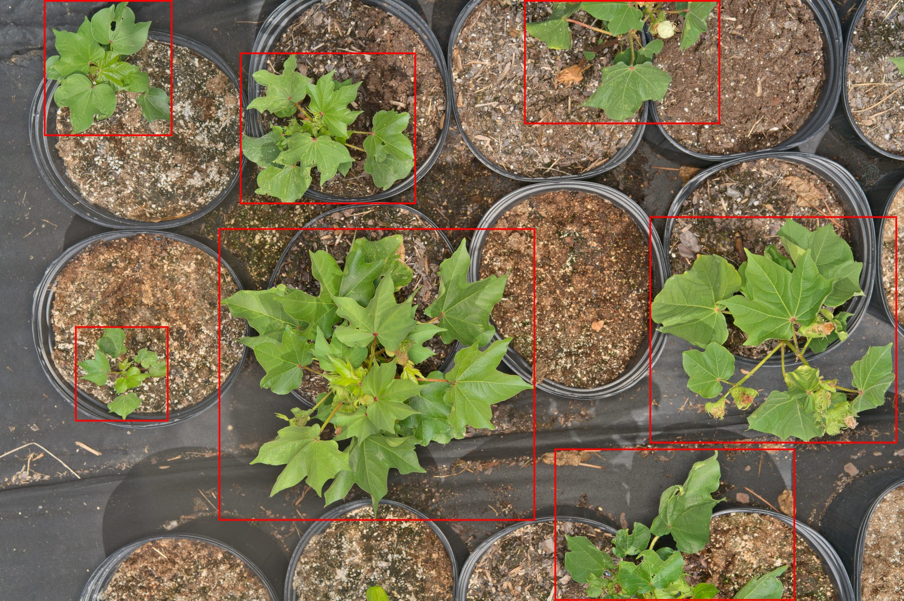
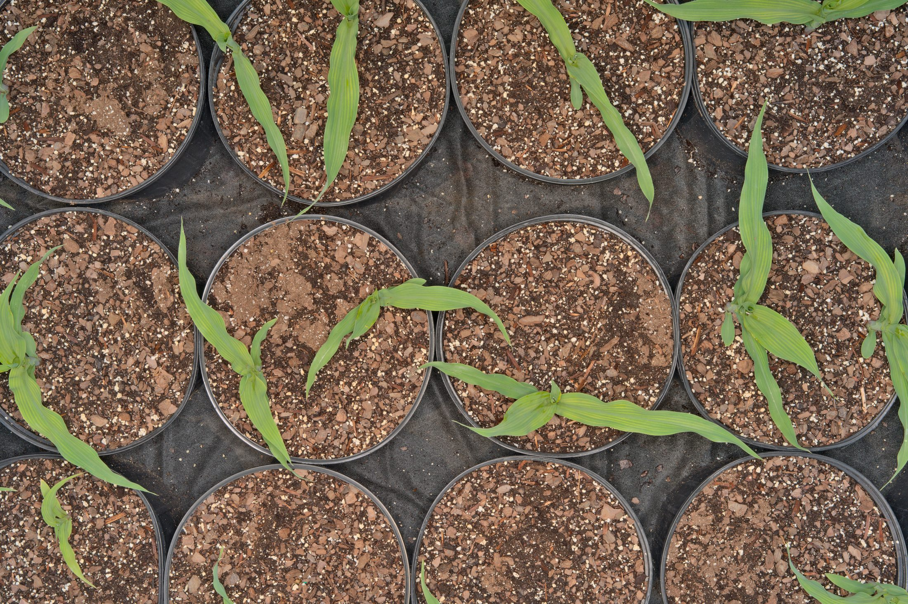
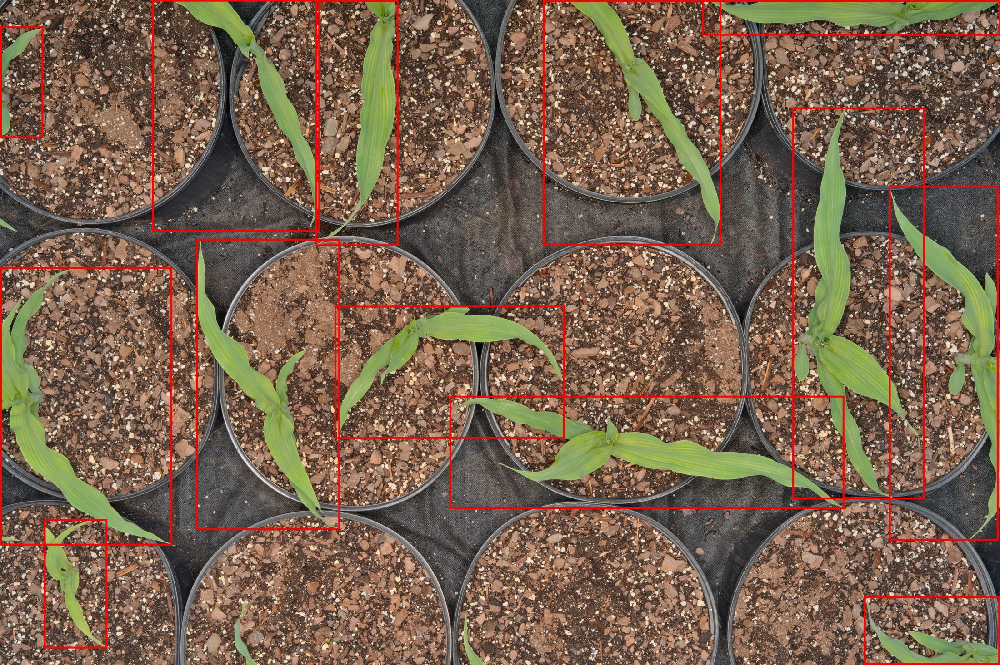
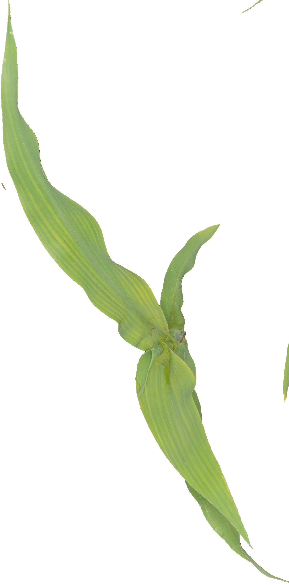
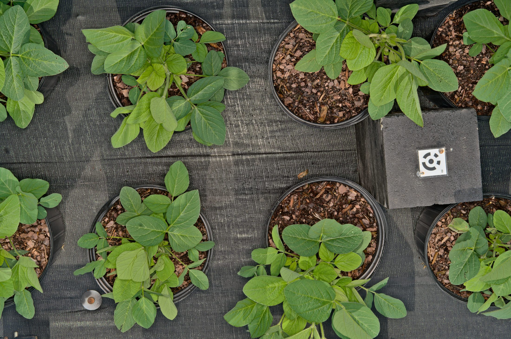
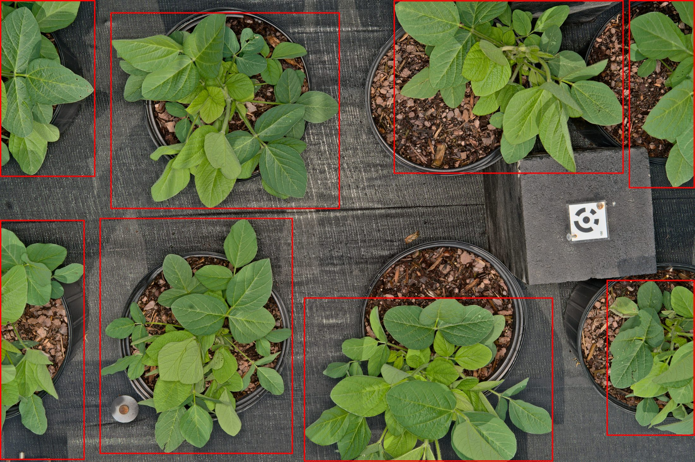
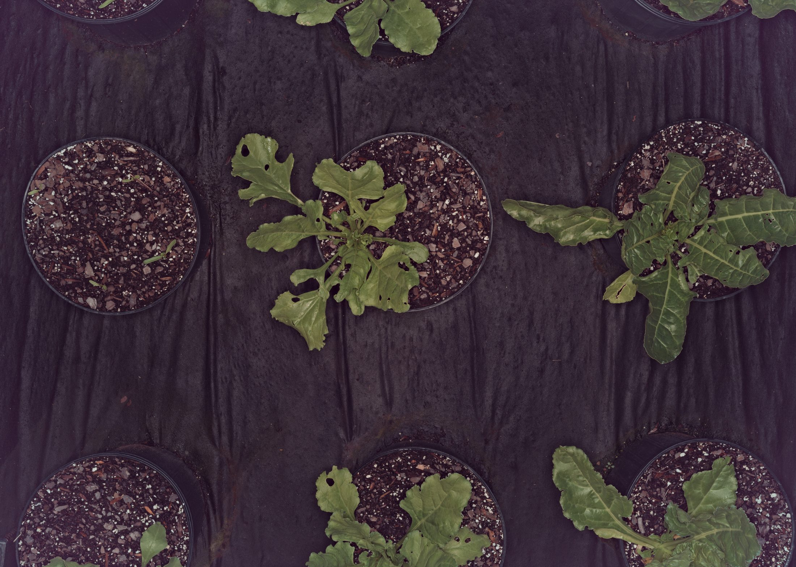
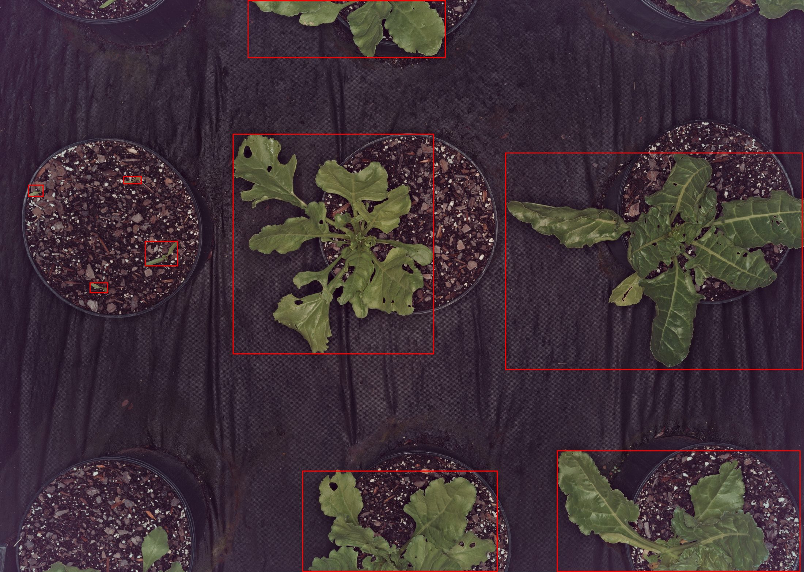

# Cash Crop Examples
{: .no_toc }

Primary agricultural commodities for commercial production.
{: .fs-6 .fw-300 }

## Table of contents
{: .no_toc .text-delta }

1. TOC
{:toc}

---

## About Cash Crops

<div class="db-card" markdown="1">

Cash crops are agricultural products grown for direct sale and commercial profit. Our dataset focuses on major row crops in the southeastern United States: cotton, corn (maize), soybean, and beet. These images support crop monitoring, species identification, and precision agriculture applications.

<span class="category-badge badge-cash-crop">Cash Crop</span>

</div>

---

## Upland Cotton (*Gossypium hirsutum*)

<div class="species-showcase" markdown="0">
  <div class="species-header">
    <h3>Upland Cotton</h3>
    <div class="species-scientific">Gossypium hirsutum L.</div>
    <div style="margin-top: 0.5rem;">
      <span class="category-badge badge-cash-crop">Cash Crop</span>
    </div>
  </div>
  
  <div class="image-comparison-grid">
    <div class="image-panel">
      <div class="image-panel-label">Original Image</div>
      <div class="image-panel-content">
        <a href="../assets/images/examples/upland_cotton_original.jpg" class="glightbox" data-title="Upland cotton - Original Field Image" data-description="Full resolution field capture.">
          
        </a>
      </div>
    </div>
    <div class="image-panel">
      <div class="image-panel-label">Bounding Box</div>
      <div class="image-panel-content">
        <a href="../assets/images/examples/upland_cotton_bbox.jpg" class="glightbox" data-title="Upland cotton - Bounding Box Overlay" data-description="Detection box overlay.">
          
        </a>
      </div>
    </div>
    <div class="image-panel">
      <div class="image-panel-label">Segmentation Mask</div>
      <div class="image-panel-content">
        <a href="../assets/images/examples/upland_cotton_mask.png" class="glightbox" data-title="Upland cotton - Segmentation Mask" data-description="Binary pixel-level mask.">
          
        </a>
      </div>
    </div>
    <div class="image-panel">
      <div class="image-panel-label">Plant Cutout</div>
      <div class="image-panel-content">
        <a href="../assets/images/examples/upland_cotton_cutout.png" class="glightbox" data-title="Upland cotton - Plant Cutout" data-description="Isolated plant cutout.">
          
        </a>
      </div>
    </div>
  </div>

  <div class="species-metadata">
    <div class="metadata-item"><span class="metadata-label">Image ID</span><span class="metadata-value">TX_1690478564</span></div>
    <div class="metadata-item"><span class="metadata-label">Cutout ID</span><span class="metadata-value">TX_1690478564_2</span></div>
    <div class="metadata-item"><span class="metadata-label">Datetime</span><span class="metadata-value">Jul 27, 2023 11:18:02</span></div>
    <div class="metadata-item"><span class="metadata-label">USDA Symbol</span><span class="metadata-value">GOHI</span></div>
    <div class="metadata-item"><span class="metadata-label">EPPO Code</span><span class="metadata-value">GOSHI</span></div>
    <div class="metadata-item"><span class="metadata-label">Growth Habit</span><span class="metadata-value">shrub</span></div>
    <div class="metadata-item"><span class="metadata-label">Estimated BBox Area (cm²)</span><span class="metadata-value">1378.4</span></div>
    <div class="metadata-item"><span class="metadata-label">BBox XYWH</span><span class="metadata-value">[2312, 2418, 3347, 3099]</span></div>
    <div class="metadata-item"><span class="metadata-label">Fullres (W×H)</span><span class="metadata-value">9560x6368</span></div>
    <div class="metadata-item"><span class="metadata-label">Lens Model</span><span class="metadata-value">FE 55mm F1.8 ZA</span></div>
    <div class="metadata-item"><span class="metadata-label">Is Primary</span><span class="metadata-value">True</span></div>
    <div class="metadata-item"><span class="metadata-label">Num Components</span><span class="metadata-value">5</span></div>
    <div class="metadata-item"><span class="metadata-label">Category RGB</span><span class="metadata-value">189, 122, 228</span></div>
    <div class="metadata-item"><span class="metadata-label">Image Path</span><span class="metadata-value">semifield-developed-images/TX_2023-07-27/images/TX_1690478564.jpg</span></div>
  </div>
</div>

---

## Maize / Corn (*Zea mays*)

<div class="species-showcase" markdown="0">
  <div class="species-header">
    <h3>Maize (Corn)</h3>
    <div class="species-scientific">Zea mays L.</div>
    <div style="margin-top: 0.5rem;">
      <span class="category-badge badge-cash-crop">Cash Crop</span>
    </div>
  </div>

  <div class="image-comparison-grid">
    <div class="image-panel">
      <div class="image-panel-label">Original Image</div>
      <div class="image-panel-content">
        <a href="../assets/images/examples/maize_original.jpg" class="glightbox" data-title="Maize - Original Field Image" data-description="Full resolution field capture.">
          
        </a>
      </div>
    </div>
    <div class="image-panel">
      <div class="image-panel-label">Bounding Box</div>
      <div class="image-panel-content">
        <a href="../assets/images/examples/maize_bbox.jpg" class="glightbox" data-title="Maize - Bounding Box Overlay" data-description="Detection box overlay.">
          
        </a>
      </div>
    </div>
    <div class="image-panel">
      <div class="image-panel-label">Segmentation Mask</div>
      <div class="image-panel-content">
        <a href="../assets/images/examples/maize_mask.png" class="glightbox" data-title="Maize - Segmentation Mask" data-description="Binary pixel-level mask.">
          
        </a>
      </div>
    </div>
    <div class="image-panel">
      <div class="image-panel-label">Plant Cutout</div>
      <div class="image-panel-content">
        <a href="../assets/images/examples/maize_cutout.png" class="glightbox" data-title="Maize - Plant Cutout" data-description="Isolated plant cutout.">
          
        </a>
      </div>
    </div>
  </div>

  <div class="species-metadata">
    <div class="metadata-item"><span class="metadata-label">Image ID</span><span class="metadata-value">MD_1688059042</span></div>
    <div class="metadata-item"><span class="metadata-label">Cutout ID</span><span class="metadata-value">MD_1688059042_2</span></div>
    <div class="metadata-item"><span class="metadata-label">Datetime</span><span class="metadata-value">Jun 29, 2023 13:15:02</span></div>
    <div class="metadata-item"><span class="metadata-label">USDA Symbol</span><span class="metadata-value">ZEA</span></div>
    <div class="metadata-item"><span class="metadata-label">EPPO Code</span><span class="metadata-value">ZEAMX</span></div>
    <div class="metadata-item"><span class="metadata-label">Growth Habit</span><span class="metadata-value">graminoid</span></div>
    <div class="metadata-item"><span class="metadata-label">Estimated BBox Area (cm²)</span><span class="metadata-value">510.9</span></div>
    <div class="metadata-item"><span class="metadata-label">BBox XYWH</span><span class="metadata-value">[1873, 2286, 1378, 2790]</span></div>
    <div class="metadata-item"><span class="metadata-label">Fullres (W×H)</span><span class="metadata-value">9560x6368</span></div>
    <div class="metadata-item"><span class="metadata-label">Lens Model</span><span class="metadata-value">FE 55mm F1.8 ZA</span></div>
    <div class="metadata-item"><span class="metadata-label">Is Primary</span><span class="metadata-value">False</span></div>
    <div class="metadata-item"><span class="metadata-label">Num Components</span><span class="metadata-value">2</span></div>
    <div class="metadata-item"><span class="metadata-label">Category RGB</span><span class="metadata-value">232, 60, 43</span></div>
    <div class="metadata-item"><span class="metadata-label">Image Path</span><span class="metadata-value">semifield-developed-images/MD_2023-06-29/images/MD_1688059042.jpg</span></div>
  </div>
</div>

---

## Soybean (*Glycine max*)

<div class="species-showcase" markdown="0">
  <div class="species-header">
    <h3>Soybean</h3>
    <div class="species-scientific">Glycine max (L.) Merr.</div>
    <div style="margin-top: 0.5rem;">
      <span class="category-badge badge-cash-crop">Cash Crop</span>
    </div>
  </div>

  <div class="image-comparison-grid">
    <div class="image-panel">
      <div class="image-panel-label">Original Image</div>
      <div class="image-panel-content">
        <a href="../assets/images/examples/soybean_original.jpg" class="glightbox" data-title="Soybean - Original Field Image" data-description="Full resolution field capture.">
          
        </a>
      </div>
    </div>
    <div class="image-panel">
      <div class="image-panel-label">Bounding Box</div>
      <div class="image-panel-content">
        <a href="../assets/images/examples/soybean_bbox.jpg" class="glightbox" data-title="Soybean - Bounding Box Overlay" data-description="Detection box overlay.">
          
        </a>
      </div>
    </div>
    <div class="image-panel">
      <div class="image-panel-label">Segmentation Mask</div>
      <div class="image-panel-content">
        <a href="../assets/images/examples/soybean_mask.png" class="glightbox" data-title="Soybean - Segmentation Mask" data-description="Binary pixel-level mask.">
          
        </a>
      </div>
    </div>
    <div class="image-panel">
      <div class="image-panel-label">Plant Cutout</div>
      <div class="image-panel-content">
        <a href="../assets/images/examples/soybean_cutout.png" class="glightbox" data-title="Soybean - Plant Cutout" data-description="Isolated plant cutout.">
          
        </a>
      </div>
    </div>
  </div>

  <div class="species-metadata">
    <div class="metadata-item"><span class="metadata-label">Image ID</span><span class="metadata-value">NC_1688393345</span></div>
    <div class="metadata-item"><span class="metadata-label">Cutout ID</span><span class="metadata-value">NC_1688393345_0</span></div>
    <div class="metadata-item"><span class="metadata-label">Datetime</span><span class="metadata-value">Jul 03, 2023 10:00:30</span></div>
    <div class="metadata-item"><span class="metadata-label">USDA Symbol</span><span class="metadata-value">GLMA4</span></div>
    <div class="metadata-item"><span class="metadata-label">EPPO Code</span><span class="metadata-value">GLXMA</span></div>
    <div class="metadata-item"><span class="metadata-label">Growth Habit</span><span class="metadata-value">forb/herb</span></div>
    <div class="metadata-item"><span class="metadata-label">Estimated BBox Area (cm²)</span><span class="metadata-value">1150.6</span></div>
    <div class="metadata-item"><span class="metadata-label">BBox XYWH</span><span class="metadata-value">[1369, 3002, 2660, 3255]</span></div>
    <div class="metadata-item"><span class="metadata-label">Fullres (W×H)</span><span class="metadata-value">9560x6368</span></div>
    <div class="metadata-item"><span class="metadata-label">Lens Model</span><span class="metadata-value">FE 55mm F1.8 ZA</span></div>
    <div class="metadata-item"><span class="metadata-label">Is Primary</span><span class="metadata-value">True</span></div>
    <div class="metadata-item"><span class="metadata-label">Num Components</span><span class="metadata-value">1</span></div>
    <div class="metadata-item"><span class="metadata-label">Category RGB</span><span class="metadata-value">160, 184, 55</span></div>
    <div class="metadata-item"><span class="metadata-label">Image Path</span><span class="metadata-value">semifield-developed-images/NC_2023-07-03/images/NC_1688393345.jpg</span></div>
  </div>
</div>

---

## Beet (*Beta vulgaris*)

<div class="species-showcase" markdown="0">
  <div class="species-header">
    <h3>Beet</h3>
    <div class="species-scientific">Beta vulgaris L.</div>
    <div style="margin-top: 0.5rem;">
      <span class="category-badge badge-cash-crop">Cash Crop</span>
    </div>
  </div>

  <div class="image-comparison-grid">
    <div class="image-panel">
      <div class="image-panel-label">Original Image</div>
      <div class="image-panel-content">
        <a href="../assets/images/examples/beet_original.jpg" class="glightbox" data-title="Beet - Original Field Image" data-description="Full resolution field capture.">
          
        </a>
      </div>
    </div>
    <div class="image-panel">
      <div class="image-panel-label">Bounding Box</div>
      <div class="image-panel-content">
        <a href="../assets/images/examples/beet_bbox.jpg" class="glightbox" data-title="Beet - Bounding Box Overlay" data-description="Detection box overlay.">
          
        </a>
      </div>
    </div>
    <div class="image-panel">
      <div class="image-panel-label">Segmentation Mask</div>
      <div class="image-panel-content">
        <a href="../assets/images/examples/beet_mask.png" class="glightbox" data-title="Beet - Segmentation Mask" data-description="Binary pixel-level mask.">
          
        </a>
      </div>
    </div>
    <div class="image-panel">
      <div class="image-panel-label">Plant Cutout</div>
      <div class="image-panel-content">
        <a href="../assets/images/examples/beet_cutout.png" class="glightbox" data-title="Beet - Plant Cutout" data-description="Isolated plant cutout.">
          
        </a>
      </div>
    </div>
  </div>

  <div class="species-metadata">
    <div class="metadata-item"><span class="metadata-label">Image ID</span><span class="metadata-value">MD_1759503060</span></div>
    <div class="metadata-item"><span class="metadata-label">Cutout ID</span><span class="metadata-value">MD_1759503060_1</span></div>
    <div class="metadata-item"><span class="metadata-label">Datetime</span><span class="metadata-value">Oct 03, 2025 14:51:00</span></div>
    <div class="metadata-item"><span class="metadata-label">USDA Symbol</span><span class="metadata-value">BEVU2</span></div>
    <div class="metadata-item"><span class="metadata-label">EPPO Code</span><span class="metadata-value">BEAVX</span></div>
    <div class="metadata-item"><span class="metadata-label">Growth Habit</span><span class="metadata-value">forb/herb</span></div>
    <div class="metadata-item"><span class="metadata-label">Estimated BBox Area (cm²)</span><span class="metadata-value">1717.5</span></div>
    <div class="metadata-item"><span class="metadata-label">BBox XYWH</span><span class="metadata-value">[8397, 2537, 4950, 3622]</span></div>
    <div class="metadata-item"><span class="metadata-label">Fullres (W×H)</span><span class="metadata-value">13368x9520</span></div>
    <div class="metadata-item"><span class="metadata-label">Lens Model</span><span class="metadata-value"></span></div>
    <div class="metadata-item"><span class="metadata-label">Is Primary</span><span class="metadata-value">False</span></div>
    <div class="metadata-item"><span class="metadata-label">Num Components</span><span class="metadata-value">0</span></div>
    <div class="metadata-item"><span class="metadata-label">Category RGB</span><span class="metadata-value">67, 110, 66</span></div>
    <div class="metadata-item"><span class="metadata-label">Image Path</span><span class="metadata-value">semifield-developed-images/MD_2025-10-03/images/MD_1759503060.jpg</span></div>
  </div>
</div>


---

## Dataset Statistics

Cash crop representation in the AgIR dataset:

| Metric | Value |
|:-------|:------|
| **Total Cash Crop Species** | 4 |
| **Total Images** | 36,000+ |
| **Total Instances (cutouts)** | 415,000+ |
| **Instances > 100 cm²** | 96,000+ |
| **Instances < 100 cm²** | 319,000+ |
| **Primary Instances** | 67,000+ |
| **Non-Primary Instances** | 278,000+ |

---

## Browse More Categories

<div class="gallery-nav" markdown="0">
  <a href="cover-crops.html" class="gallery-nav-btn">
    <span class="gallery-nav-icon">🌱</span>
    <span class="gallery-nav-title">Cover Crops</span>
    <span class="gallery-nav-desc">20+ species</span>
  </a>
  
  <a href="weeds.html" class="gallery-nav-btn">
    <span class="gallery-nav-icon">🌿</span>
    <span class="gallery-nav-title">Weeds</span>
    <span class="gallery-nav-desc">30+ weed species</span>
  </a>
</div>

<!-- --- -->
<!-- 
## Accessing the Data

{: .note }
> **Query cash crop data** using the AgIR-CVToolkit with filters for species and field conditions.

**Example queries:**

```bash
# Query cotton images
agir-cvtoolkit query --db field \
  --filters "common_name=cotton"

# Query corn images
agir-cvtoolkit query --db semif \
  --filters "category_common_name=corn"

# Query soybean images
agir-cvtoolkit query --db field \
  --filters "common_name=soybean"

# Query beet images
agir-cvtoolkit query --db semif \
  --filters "category_common_name=beet"

# Sample balanced across all cash crops
agir-cvtoolkit query --db field \
  --filters "common_name=cotton,corn,soybean,beet" \
  --sample "stratified:by=common_name,per_group=100"
```

[Learn How to Query →](https://github.com/yourusername/AgIR-CVToolkit/blob/main/docs/PIPELINE_STAGES/01_query/db_query_usage.md){: .btn .btn-primary } -->