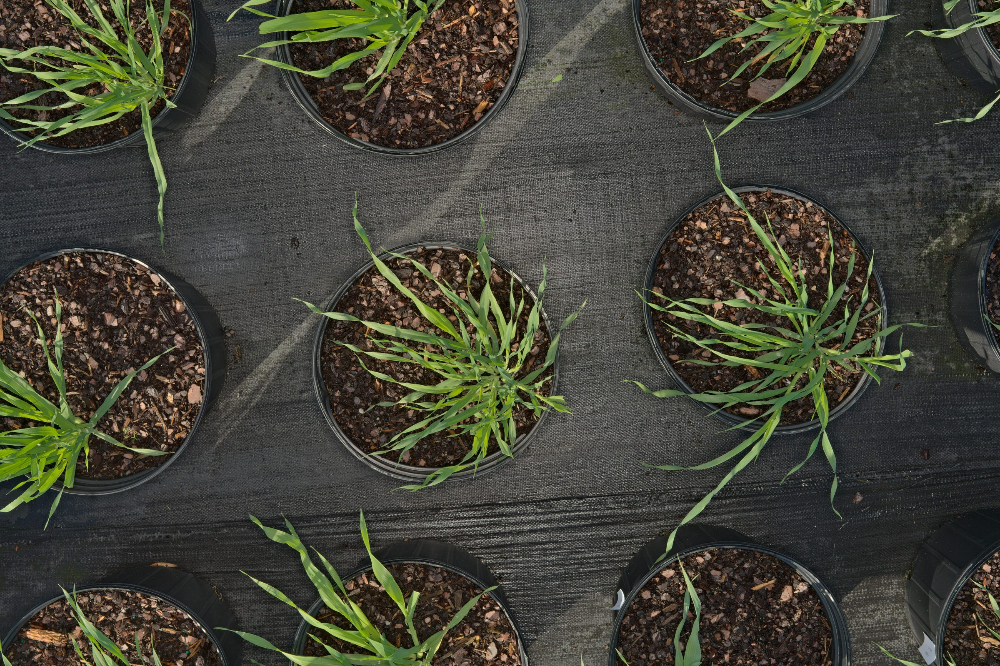
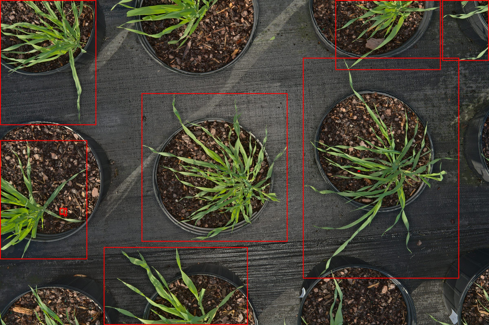
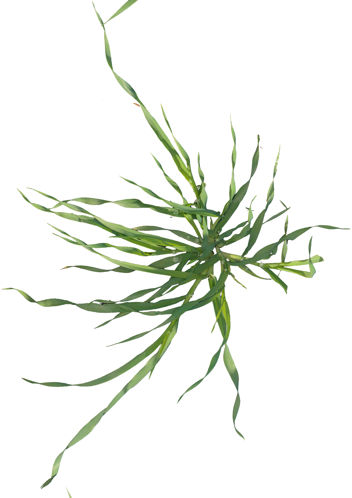

# Cover Crop Examples
{: .no_toc }

Cover crops for soil health, nitrogen fixation, and erosion control.
{: .fs-6 .fw-300 }

## Table of contents
{: .no_toc .text-delta }

1. TOC
{:toc}

---

## About Cover Crops

Cover crops are planted to manage soil erosion, soil fertility, soil quality, water, weeds, pests, diseases, biodiversity and wildlife in agroecosystems. Common cover crops in our dataset include cereals (barley, wheat, rye), legumes (vetch, clover), and brassicas (radish, turnip).

Cover Crop

---
## Barley (*Hordeum vulgare*)

  

    <h3>Barley</h3>
    
Hordeum vulgare L.

    

      Cover Crop
    

  

  
  

    

      
Original Image

      

        
      

    

    
    

      
Bounding Box

      

        
      

    

    
    

      
Segmentation Mask

      

        
      

    

    
    

      
Plant Cutout

      

        
      

    

  

  
  

    

      USDA Symbol
      HOVU
    

    

      Common Name
      Barley
    

    

      Family
      Poaceae
    

    

      Growth Habit
      Grass
    

    

      Location
      North Carolina
    

    

      Season
      2022-2023
    

    

      Capture Date
      Nov 9, 2022
    

    

      Image ID
      NC_1668004918
    

    

      Area
      1,756 cm² (Large)
    

    

      Batch ID
      NC_2022-11-09
    

    

      BBot Version
      2.0
    

    

      Database
      SEMIF
    

  

---

## Hairy Vetch (*Vicia villosa*)

  

    <h3>Hairy Vetch</h3>
    
Vicia villosa Roth

    

      Cover Crop
    

  

  
  

    

      
Original Image

      

        

          Hairy vetch field image 
          SC, Spring 2024 
          Flowering stage
        

      

    

    
    

      
Bounding Box

      

        

          Detection box overlay 
          Vining growth habit 
          Multiple components
        

      

    

    
    

      
Segmentation Mask

      

        

          Complex vine structure 
          Human-verified 
          High precision
        

      

    

    
    

      
Plant Cutout

      

        

          Isolated vetch plant 
          Purple flowers visible 
          Large area
        

      

    

  

  
  

    

      USDA Symbol
      VIVI2
    

    

      Family
      Fabaceae
    

    

      Growth Habit
      Vine
    

    

      Duration
      Annual
    

    

      Location
      South Carolina
    

    

      Area
      542 cm² (Large)
    

    

      Growth Stage
      Flowering
    

    

      Components
      4 (vining)
    

  

---

## Crimson Clover (*Trifolium incarnatum*)

  

    <h3>Crimson Clover</h3>
    
Trifolium incarnatum L.

    

      Cover Crop
    

  

  
  

    

      
Original Image

      

        

          Crimson clover field 
          GA, Spring 2023 
          Dense ground cover
        

      

    

    
    

      
Bounding Box

      

        

          Detection box overlay 
          Compact rosette form 
          Medium size
        

      

    

    
    

      
Segmentation Mask

      

        

          Trifoliate leaf structure 
          Human-verified 
          Clean segmentation
        

      

    

    
    

      
Plant Cutout

      

        

          Isolated clover 
          Characteristic leaves 
          Vegetative stage
        

      

    

  

  
  

    

      USDA Symbol
      TRIN3
    

    

      Family
      Fabaceae
    

    

      Growth Habit
      Forb
    

    

      Duration
      Annual
    

    

      Location
      Georgia
    

    

      Area
      156 cm² (Small)
    

    

      Growth Stage
      Vegetative
    

    

      Confidence
      0.94
    

  

---

## More Cover Crop Species

Additional cover crop species in the dataset:

**Cereal Rye**  
*Secale cereale*  
USDA: SECE | Poaceae

**Wheat**  
*Triticum aestivum*  
USDA: TRAE | Poaceae

**Austrian Winter Pea**  
*Pisum sativum*  
USDA: PISA6 | Fabaceae

**Oats**  
*Avena sativa*  
USDA: AVSA | Poaceae

**Radish**  
*Raphanus sativus*  
USDA: RASA | Brassicaceae

**Annual Ryegrass**  
*Lolium multiflorum*  
USDA: LOMU | Poaceae

---

## Dataset Statistics

Cover crop representation in the AgIR dataset:

| Metric | Value |
|:-------|:------|
| **Total Cover Crop Species** | 40+ |
| **Total Images** | 18,000+ |
| **Most Common** | Barley, Hairy Vetch, Cereal Rye |
| **Growth Stages** | Vegetative, Flowering, Seed Set |
| **Geographic Coverage** | NC, SC, GA, VA, MS |

---

## Browse More Categories

  <a href="weeds.html" class="gallery-nav-btn">
    🌿
    Weeds
    80+ weed species
  </a>
  
  <a href="cash-crops.html" class="gallery-nav-btn">
    🌾
    Cash Crops
    30+ crop varieties
  </a>

