# Weed Examples
{: .no_toc }

Target weed species for detection and management in agricultural systems.
{: .fs-6 .fw-300 }

## Table of contents
{: .no_toc .text-delta }

1. TOC
{:toc}

---

## About Weeds

Weeds compete with crops for resources and can significantly reduce yields. Our dataset includes comprehensive annotations for major agricultural weed species across broadleaf and grass categories. These images support automated weed detection, species identification, and precision management systems.

Weed

---

## Palmer Amaranth (*Amaranthus palmeri*)

  

    <h3>Palmer Amaranth</h3>
    
Amaranthus palmeri S. Watson

    

      Weed
    

  

  
  

    

      
Original Image

      

        <a href="../assets/images/examples/palmer_amaranth_original.jpg" class="glightbox" data-title="Palmer Amaranth - Original Field Image" data-description="Full resolution field capture. GA, Summer 2023. Cotton field infestation.">
          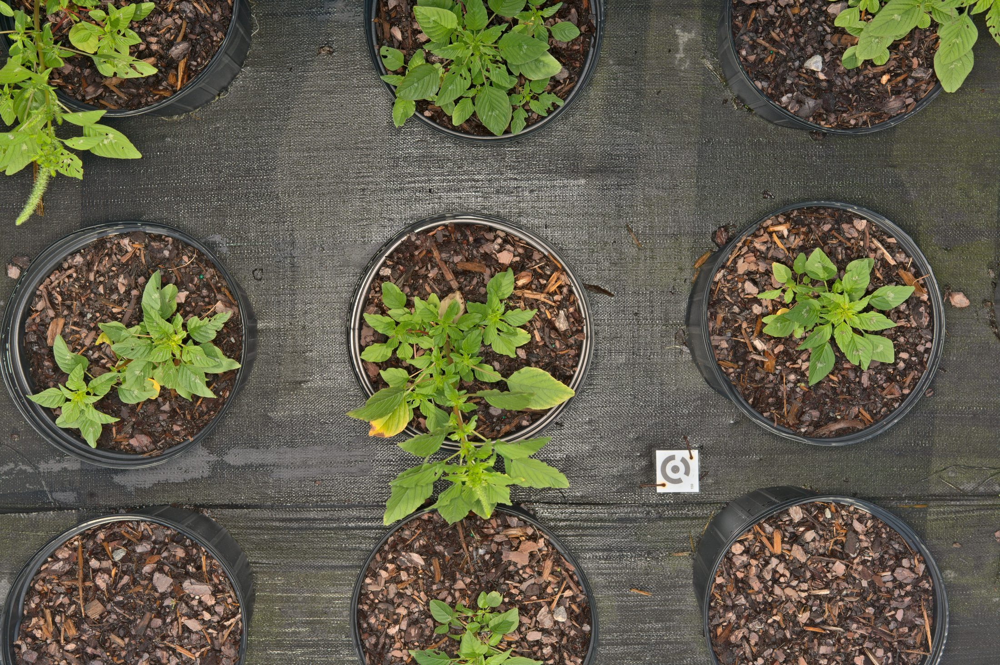
        </a>
      

    

    

      
Bounding Box

      

        <a href="../assets/images/examples/palmer_amaranth_bbox.jpg" class="glightbox" data-title="Palmer Amaranth - Bounding Box Overlay" data-description="Detection box overlay. Upright growth habit. Area: 892 cm²">
          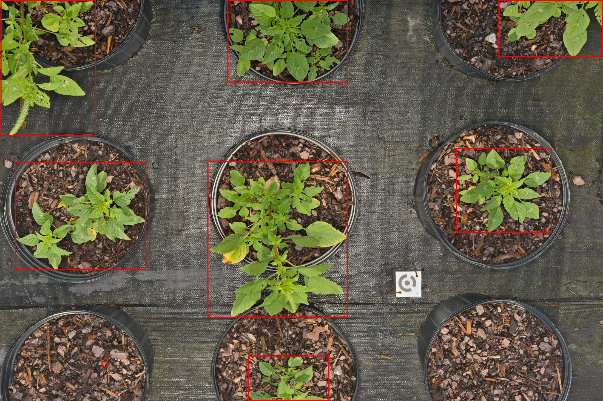
        </a>
      

    

    

      
Segmentation Mask

      

        
      

    

    

      
Plant Cutout

      

        <a href="../assets/images/examples/palmer_amaranth_cutout.png" class="glightbox" data-title="Palmer Amaranth - Plant Cutout" data-description="Isolated Palmer amaranth. Vegetative stage, characteristic leaf shape.">
          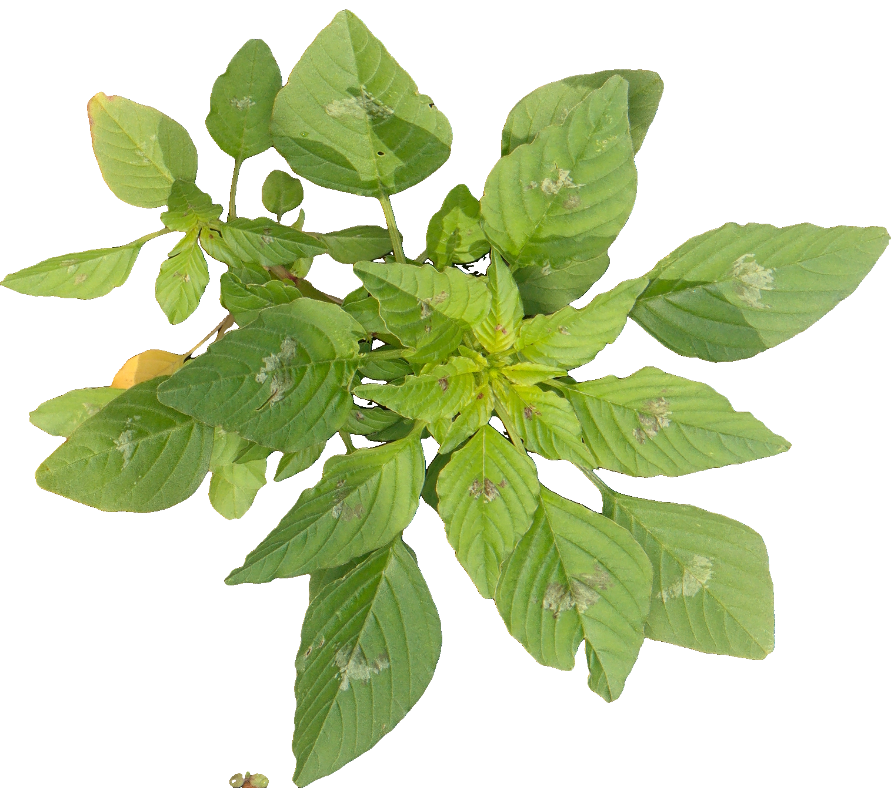
        </a>
      

    

  

  

    
Image IDNC_1661519848

    
Cutout IDNC_1661519848_1

    
DatetimeAug 26, 2022 09:15:20

    
USDA SymbolAMPA

    
EPPO CodeAMAPA

    
Growth Habitforb/herb

    
Estimated BBox Area (cm²)270.7

    
BBox XYWH[7232, 2354, 1519, 1341]

    
Fullres (W×H)9560x6368

    
Lens ModelFE 55mm F1.8 ZA

    
Is PrimaryFalse

    
Num Components1

    
Category RGB29, 104, 110

    
Image Pathsemifield-developed-images/NC_2022-08-26/images/NC_1661519848.jpg

  

---

## Pitted Morning-glory (*Ipomoea lacunosa*)

  

    <h3>Pitted Morning-glory</h3>
    
Ipomoea lacunosa L.

    

      Weed
    

  

  
  

    

      
Original Image

      

        <a href="../assets/images/examples/pitted_morning-glory_original.jpg" class="glightbox" data-title="Pitted Morning-glory - Original Field Image" data-description="Full resolution field capture. SC, July 2023. Climbing vine behavior.">
          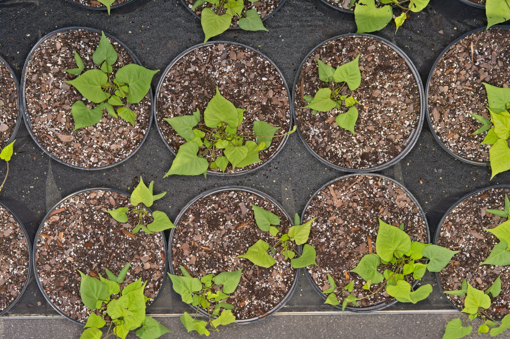
        </a>
      

    

    

      
Bounding Box

      

        <a href="../assets/images/examples/pitted_morning-glory_bbox.jpg" class="glightbox" data-title="Pitted Morning-glory - Bounding Box Overlay" data-description="Detection box overlay. Twining stems, multi-component. Area: 1,245 cm²">
          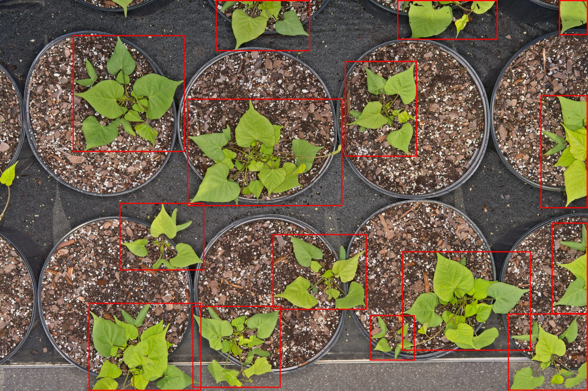
        </a>
      

    

    

      
Segmentation Mask

      

        
      

    

    

      
Plant Cutout

      

        <a href="../assets/images/examples/pitted_morning-glory_cutout.png" class="glightbox" data-title="Pitted Morning-glory - Plant Cutout" data-description="Isolated morning-glory. Characteristic foliage, white flower visible.">
          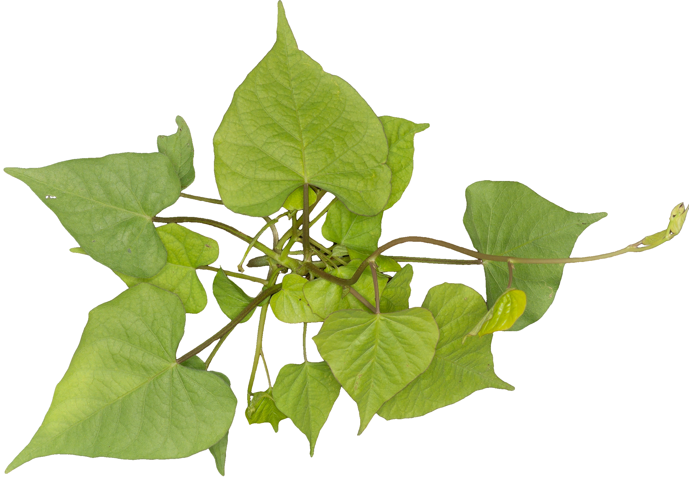
        </a>
      

    

  

  

    
Image IDMD_1690814343

    
Cutout IDMD_1690814343_0

    
DatetimeJul 31, 2023 10:36:32

    
USDA SymbolIPLA

    
EPPO CodeIPOLA

    
Growth Habitforb/herb vine

    
Estimated BBox Area (cm²)460.3

    
BBox XYWH[1182, 572, 1820, 1903]

    
Fullres (W×H)9560x6368

    
Lens ModelFE 55mm F1.8 ZA

    
Is PrimaryFalse

    
Num Components4

    
Category RGB214, 168, 70

    
Image Pathsemifield-developed-images/MD_2023-07-31/images/MD_1690814343.jpg

  

{: .note }
> **Management Challenge**: Vining growth habit makes morning-glory particularly difficult to control once established.

---

## Jimson Weed (*Datura stramonium*)

  

    <h3>Jimson Weed</h3>
    
Datura stramonium L.

    

      Weed
    

  

  
  

    

      
Original Image

      

        <a href="../assets/images/examples/jimson_weed_original.jpg" class="glightbox" data-title="Jimson Weed - Original Field Image" data-description="Full resolution field capture. NC, Summer 2023. Post-harvest field.">
          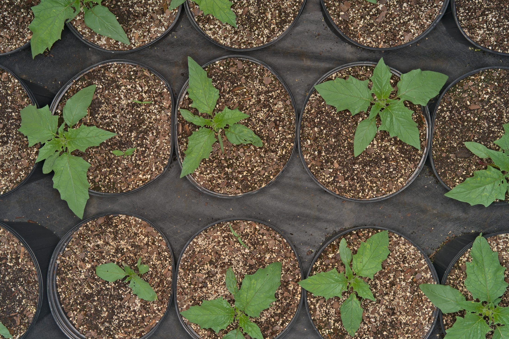
        </a>
      

    

    

      
Bounding Box

      

        
      

    

    

      
Segmentation Mask

      

        
      

    

    

      
Plant Cutout

      

        <a href="../assets/images/examples/jimson_weed_cutout.png" class="glightbox" data-title="Jimson Weed - Plant Cutout" data-description="Isolated jimson weed. Distinctive deeply-lobed leaves, vegetative stage.">
          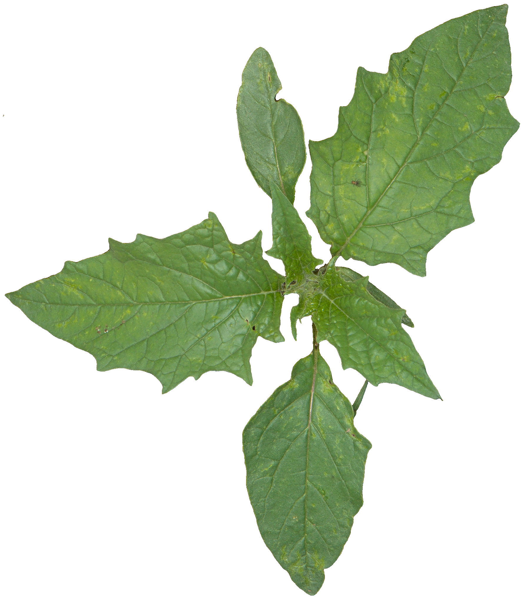
        </a>
      

    

  

  

    
Image IDMD_Row-25_1657135455

    
Cutout IDMD_Row-25_1657135455_1

    
DatetimeJul 07, 2022 03:21:12

    
USDA SymbolDAST

    
EPPO CodeDATST

    
Growth Habitforb/herb, subshrub

    
Estimated BBox Area (cm²)477.0

    
BBox XYWH[5565, 4306, 1770, 2028]

    
Fullres (W×H)9560x6368

    
Lens ModelFE 55mm F1.8 ZA

    
Is PrimaryFalse

    
Num Components1

    
Category RGB207, 234, 124

    
Image Pathsemifield-developed-images/MD_2022-07-06/images/MD_Row-25_1657135455.jpg

  

---

## Horseweed (*Erigeron canadensis*)

  

    <h3>Horseweed</h3>
    
Erigeron canadensis L.

    

      Weed
    

  

  
  

    

      
Original Image

      

        <a href="../assets/images/examples/horseweed_original.jpg" class="glightbox" data-title="Horseweed - Original Field Image" data-description="Full resolution field capture. VA, August 2023. Soybean field.">
          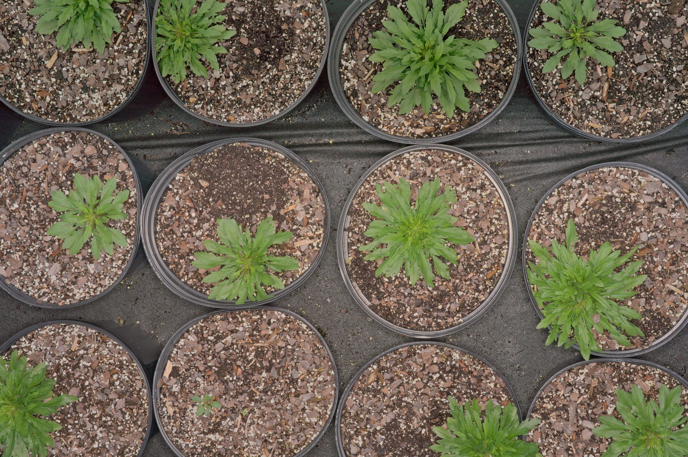
        </a>
      

    

    

      
Bounding Box

      

        <a href="../assets/images/examples/horseweed_bbox.jpg" class="glightbox" data-title="Horseweed - Bounding Box Overlay" data-description="Detection box overlay. Erect growth, narrow leaves. Area: 345 cm²">
          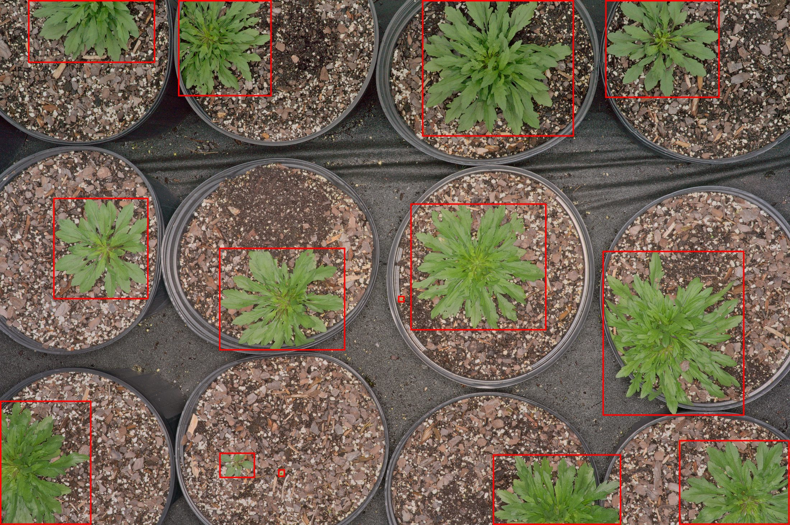
        </a>
      

    

    

      
Segmentation Mask

      

        
      

    

    

      
Plant Cutout

      

        <a href="../assets/images/examples/horseweed_cutout.png" class="glightbox" data-title="Horseweed - Plant Cutout" data-description="Isolated horseweed. Linear leaves, vegetative rosette stage.">
          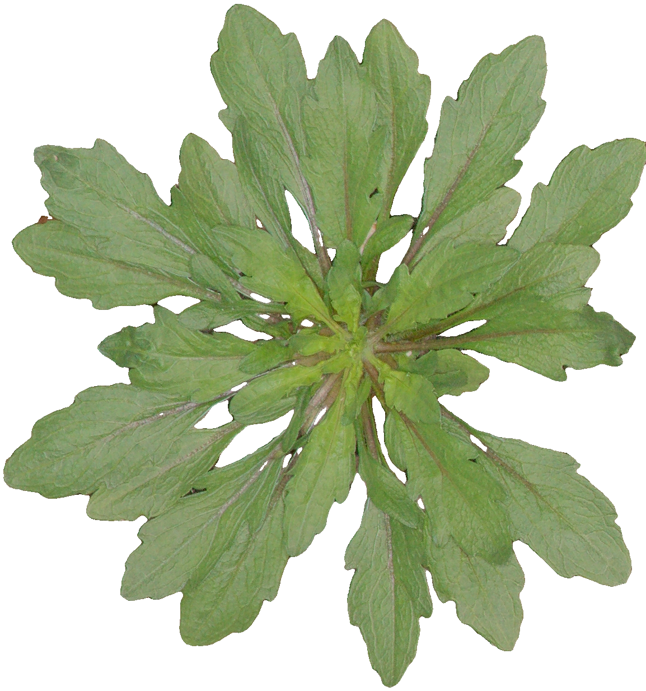
        </a>
      

    

  

  

    
Image IDMD_1696013257

    
Cutout IDMD_1696013257_0

    
DatetimeSep 29, 2023 14:44:53

    
USDA SymbolERCA20

    
EPPO CodeERICA

    
Growth Habitforb/herb

    
Estimated BBox Area (cm²)188.9

    
BBox XYWH[643, 2398, 1154, 1232]

    
Fullres (W×H)9560x6368

    
Lens ModelFE 55mm F1.8 ZA

    
Is PrimaryFalse

    
Num Components2

    
Category RGB90, 237, 195

    
Image Pathsemifield-developed-images/MD_2023-09-29/images/MD_1696013257.jpg

  

---

## More Weed Species

Additional weed species represented in the dataset:

**Barnyardgrass**  
*Echinochloa crus-galli*  
EPPO: ECHCG | Poaceae

**Bermudagrass**  
*Cynodon dactylon*  
EPPO: CYNDA | Poaceae

**Broadleaf Signalgrass**  
*Urochloa platyphylla*  
EPPO: BRAPP | Poaceae

**Browntop Millet**  
*Urochloa ramosa*  
EPPO: PANRA | Poaceae

**Canada Thistle**  
*Cirsium arvensis*  
EPPO: CIRAR | Asteraceae

**Cocklebur**  
*Xanthium strumarium*  
EPPO: XANST | Asteraceae

**Common Lambsquarters**  
*Chenopodium album*  
EPPO: CHEAL | Chenopodiaceae

**Common Pokeweed**  
*Phytolacca americana*  
EPPO: PHTAM | Phytolaccaceae

**Common Ragweed**  
*Ambrosia artemisiifolia*  
EPPO: AMBEL | Asteraceae

**Common Sunflower**  
*Helianthus annuus*  
EPPO: HELAN | Asteraceae

**Desert Horsepurslane**  
*Trianthema portulacastrum*  
EPPO: TRTPO | Aizoaceae

**Fall Panicum**  
*Panicum dichotomiflorum*  
EPPO: PANDI | Poaceae

**Giant Foxtail**  
*Setaria faberi*  
EPPO: SETFA | Poaceae

**Goosegrass**  
*Eleusine indica*  
EPPO: ELEIN | Poaceae

**Ivyleaf Morning-Glory**  
*Ipomoea hederacea*  
EPPO: IPOHE | Convolvulaceae

**Johnsongrass**  
*Sorghum halepense*  
EPPO: SORHA | Poaceae

**Jungle Rice**  
*Echinochloa colona*  
EPPO: ECHCO | Poaceae

**Kochia**  
*Bassia scoparia*  
EPPO: KCHSC | Chenopodiaceae

**Large Crabgrass**  
*Digitaria sanguinalis*  
EPPO: DIGSA | Poaceae

**Prickly Sida**  
*Sida spinosa*  
EPPO: SIDSP | Malvaceae

**Purple Nutsedge**  
*Cyperus rotundus*  
EPPO: CYPRO | Cyperaceae

**Ragweed Parthenium**  
*Parthenium hysterophorus*  
EPPO: PTNHY | Asteraceae

**Sicklepod**  
*Senna obtusifolia*  
EPPO: CASOB | Fabaceae

**Smooth Pigweed**  
*Amaranthus hybridus*  
EPPO: AMACH | Amaranthaceae

**Spiny Amaranth**  
*Amaranthus spinosus*  
EPPO: AMASP | Amaranthaceae

**Sprawling Signalgrass**  
*Urochloa reptans*  
EPPO: PANRP | Poaceae

**Texas Millet**  
*Urochloa texana*  
EPPO: PANTE | Poaceae

**Velvetleaf**  
*Abutilon theophrasti*  
EPPO: ABUTH | Malvaceae

**Venice Mallow**  
*Hibiscus trionum*  
EPPO: HIBTR | Malvaceae

**Waterhemp**  
*Amaranthus tuberculatus*  
EPPO: AMATU | Amaranthaceae

**Wild Oats**  
*Avena fatua*  
EPPO: AVEFA | Poaceae

**Yellow Foxtail**  
*Setaria pumila*  
EPPO: SETPU | Poaceae

**Yellow Nutsedge**  
*Cyperus esculentus*  
EPPO: CYPES | Cyperaceae

**Zoysia**  
*Zoysia japonica*  
EPPO: ZOYJA | Poaceae

---

## Dataset Statistics

Weed species representation in the AgIR (SemiF) dataset:

| Metric | Value |
|:-------|:------|
| **Total Weed Species** | 38 |
| **Total Images** | 70,000+ |
| **Total Instances (cutouts)** | 1,280,000+ |
| **Instances > 100 cm²** | 148,000+ |
| **Instances < 100 cm²** | 1,132,000+ |
| **Primary Instances** | 250,000+ |
| **Non-Primary Instances** | 1,027,000+ |

---

## Browse More Categories

  <a href="cover-crops.html" class="gallery-nav-btn">
    🌱
    Cover Crops
    40+ species
  </a>
  
  <a href="cash-crops.html" class="gallery-nav-btn">
    🌾
    Cash Crops
    30+ crop varieties
  </a>

